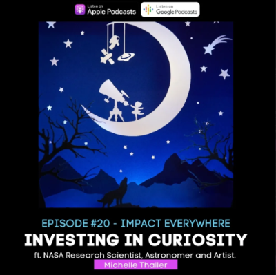
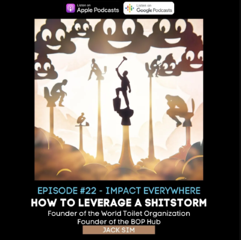
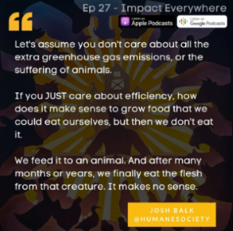
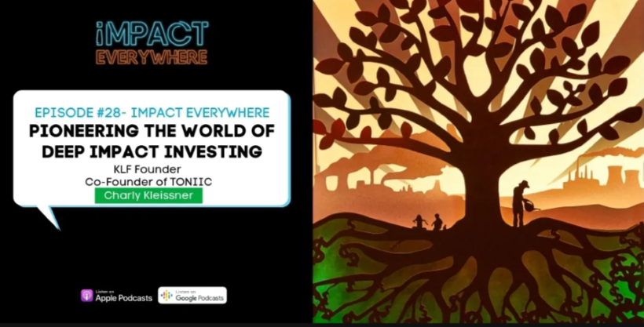

# Basia Karpinski
*I'm the support character on your all-star team.*

## Education
- **Educational Technology, Masters &nbsp;&nbsp;&nbsp;&nbsp; *The University of British Columbia (2020)*** 
  - Courses: business and professional ethics, research methodology, instructional design, mobile & open technology, EdTech ventures, andragogy, English grammar and usage  

- **Multimedia, Hon. Bachelors &nbsp;&nbsp;&nbsp;&nbsp;&nbsp;&nbsp;&nbsp;&nbsp; *McMaster University (2015)***  
  - Courses: leadership and mentorship, second language acquisition, shorter literary genres, communication theory, qualitative and quantitative methods, creative industry project management, code strategies, programming & design fundamentals, interactive & spatial audio  

 &nbsp;&nbsp;&nbsp;&nbsp;  

## Work Experience  

### **Asset Library Data Wrangler** @ *Electronic Arts Inc* &nbsp;&nbsp;&nbsp;&nbsp; (Dec 2023 – Mar 2024)  
- Quality assurance and indexing 8000+ motion capture assets for data library
- Preparing frame-accurate datasets for machine learning
- Streamlining asset ingestion pipeline and library management
- Validating accuracy of metadata for large-scale databases  

*Skills:* database management & validation, Nasuni cloud storage, Airtable, Shotgrid, Slack  

### **Volumetric Capture Technician** @ *Departure Lounge* &nbsp;&nbsp;&nbsp;&nbsp; (Aug 2022 – Nov 2023)  
- Installing, wiring, disassembling LED virtual production volumes (100-16,000 wall + ceiling) [See the permanent volume here](https://en.versatile.media/magic-hour-all-day-versatile-media-offers-unbelievable-vancouver-facility-for-filmmakers/)
- Maintaining the volumetric capture stage, including pre-shoot prep, reconfiguration, and shoot operation, coordinating lighting, audio technicians, and makeup/wardrobe department  
- Updating, maintaining, and troubleshooting camera and stage hardware and firmware
- Editing and troubleshooting proprietary pipeline elements  
- Exporting, organizing, and preconditioning capture data, preparing previews for clients
- Post-processing data for client delivery, including quality control and manual corrections
- Creating stage operation and processing documentation for cross-training
- Testing and debugging third-party software & hardware 
- Research and development to improve quality and push the capabilities of volumetric video integration  

*Work Samples:*  

  &nbsp;&nbsp;&nbsp;&nbsp;
  &nbsp;&nbsp;&nbsp;&nbsp;
  &nbsp;&nbsp;&nbsp;&nbsp;
   

*Skills:* volumetric video, photogrammetry, IOI Volucam & StudioCap, Microsoft Mixed Reality Capture Studios, Parsec, Remote Desktop Connection, Perforce, Isilon storage, Azure Active Directory, Azure cloud processing, Clickup, Slack, Discord, Google office suite, Zoom, event planning & logistics, virtual production installation, workstation configuration, remote render farm management, python, command line, log file troubleshooting, IT support

### **Capture Data Wrangler** @ *Electronic Arts Inc.*	&nbsp;&nbsp;&nbsp;&nbsp;&nbsp;&nbsp;&nbsp;&nbsp;  (Sept 2020 – Aug 2022)  
- Setting up studio programs for motion, performance, director’s camera, & 3D scan captures for **Madden, FIFA, Dragon Age, Skate, SIMS, UFC, PGA Tour, College Football, etc.**
- Ingesting, conditioning, and processing internal and external vendor capture data for delivery to clients and other departments using cloud storage and web-based applications  
- Acting as first level of tech support for database, pipeline, delivery, and access issues
- Compiling procedures into easy-to-understand manuals and guides for new employees
- Processing photogrammetry, photometric, & 4D scans into digital models  

*Game Credits:*  
[Madden 23](https://youtu.be/PSFCBmMuxIg?si=02D9vEQX7ORDIQ7R&t=229)  
[FIFA 22](https://youtu.be/eTZxMoRtqk4?si=TIbQSXWcvcFSO8ND&t=583)  
[FIFA 23](https://youtu.be/o89Jg-h7N3k?si=zH7oM6YHvCrT9vUs&t=1974)  
[Dead Space Remake](https://youtu.be/XzY8GBSNydQ?si=aNuXmqCmwoKvlKQO&t=913)  

*Skills:* optical & inertial motion capture, photogrammetry, photometrics, facial performance capture, FACS, director's camera, AWS cloud processing, Nasuni cloud storage, MotionBuilder, Shogun, Shotgrid, Perforce, monday.com, Google office suite, Slack, JIRA, Zoom, Remote Desktop Connection, Agisoft Metashape, Maya, Qube render manager, RealityCapture, 3DF Zephyr, VisualSFM, COLMAP, python, log file troubleshooting, IT support  

### **Producer @ *Impact Everywhere Podcast*** &nbsp;&nbsp;&nbsp;&nbsp;&nbsp;&nbsp;&nbsp;&nbsp; (June 2020 – Oct 2020)  
- Researching & corresponding with potential interview guests, **preparing profiles and interview questions**
- Supervising interviews and **directing interview** flow via back-channel communications to podcast host
- **Post-production:** cleaning raw audio files for cohesion and highlighting potential promotional sound bites
- Creating and scheduling **text-based, still, & audio-visual social media assets** for marketing  

[Listen to episodes 15-30 here](https://open.spotify.com/show/0rQV8hOcxSgrsEL4oW3Gu7?go=1&sp_cid=6289bf82fbba783379f7a1b1b89d835d&utm_source=embed_player_p&utm_medium=desktop&nd=1&dlsi=2f65378183254afe)  
Sample episodes worked on:  
  &nbsp;&nbsp;&nbsp;&nbsp;
  &nbsp;&nbsp;&nbsp;&nbsp;  
  &nbsp;&nbsp;&nbsp;&nbsp;  
  &nbsp;&nbsp;&nbsp;&nbsp;  
  

Kobe Municipal Board of Education: Assistant Language Teacher  Kobe, Japan	 [Feb 2016 – June 2020]
Leading professional development seminars for educators about national curriculum changes, instructional design, work ethic, inquiry methods, edtech in the classroom
Corresponding with ministry regarding World Wide Learning (WWL) Ministry of Education initiatives
Supervising students in independent research, international conference planning, activism campaigns
Creating curricula, standards, and evaluation for senior-level courses in academic writing, entrance exam strategies, multimedia content creation, product design, organ transplantation, A.I., education, leadership
Assistant coaching for boys’ volleyball team, parliamentary debate, and national speech contestants

### Projects

### Certifications

### Testimonials

[def]: https://medium.com/impact-everywhere/jack-sim-toilet-podcast-11aa7937040b "Creating a Shitstorm for Good with Jack Sim"